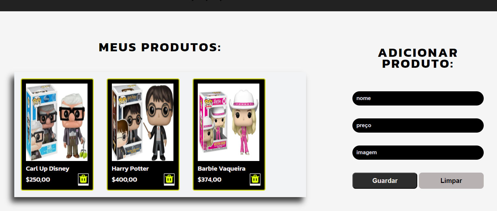

# Mundo Geek 👾


## 🔗 Descrição do Projeto

Aprender fazendo! 🚀<br>
Este e-commerce nasceu como um desafio do programa ONE (Oracle + Alura), com o foco em aplicar o conceito de CRUD em um contexto real.

## 🔧 Funcionalidades do projeto
**O usuário será capaz de:**<br>
 - Preencher o formulário com a descrição do produto como: <br>
     - Nome, preço e URL da imagem.
     - Salvar as informações do produto que será redirecionado para a seção de produtos.
     - Caso tenha errado alguma informação na hora do preenchimento do formulário, será capaz de limpar os campos e inserir novamente as informações corretas.

- Na seção de produtos o usuário poderá realizar a exclusão de algum produto que não deseja ter mais em sua seção.

     
## 📁 Como Executar o Projeto

Siga estes passos para baixar, configurar e executar o projeto localmente na sua máquina:

**1. Baixando o Código-Fonte:**

- Clique aqui para fazer o download do código-fonte: [Baixar Projeto](https://github.com/DrielySantos/mundo-geek/archive/refs/heads/main.zip)
- Após o download, descompacte o arquivo em um local de sua preferência no seu computador.

**2. Instalando o Node.js:**

- **Verifique se você já tem o Node.js instalado:**<br>
Abra o terminal (ou prompt de comando) e digite `node -v`. Se a versão do Node.js for exibida, você pode pular para o passo 3.
- **Caso não tenha o Node.js:**
    - Acesse o site oficial do Node.js: [https://nodejs.org/](https://nodejs.org/)
    - Baixe a versão recomendada para o seu sistema operacional (Windows, macOS ou Linux).
    - Execute o instalador e siga as instruções na tela.
    - **Verifique a instalação:** Após a instalação, abra um novo terminal e digite `node -v` e `npm -v`. Se as versões forem exibidas corretamente, o Node.js foi instalado com sucesso.

**3. Iniciando o Servidor Local:**

> **Importante:**  
> * Certifique-se de que você está no diretório correto do projeto no seu terminal (aquele em que você descompactou o arquivo .zip).
> * Adapte o comando abaixo caso o nome do seu arquivo JSON seja diferente de `db.json`.

- Abra o terminal e navegue até a pasta `src/database` do projeto:
  ```bash
  cd caminho/para/o/seu/projeto/mundo-geek/src/database 
  ```
  - Inicie o servidor JSON:
  ```bash
  json-server --watch ./db.json
  ```
  
**4. Abrindo o Projeto no Navegador:**

- Abra o arquivo index.html na raiz do seu projeto com o Live Server.

*Dica: Se você estiver usando o VS Code, é altamente recomendável instalar a extensão "Live Server". Ela facilita muito a visualização de projetos web.*

## Pronto! 🎉<br>
Agora você pode usar, explorar o código e se aventurar neste projeto!

## ⚙️ Tecnologias Utilizadas


## 🤓 Desenvolvedor
*Desenvolvido por* [Driely Santos](https://www.linkedin.com/in/drielysantos/)